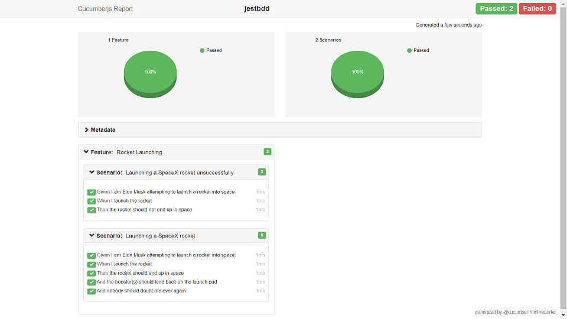
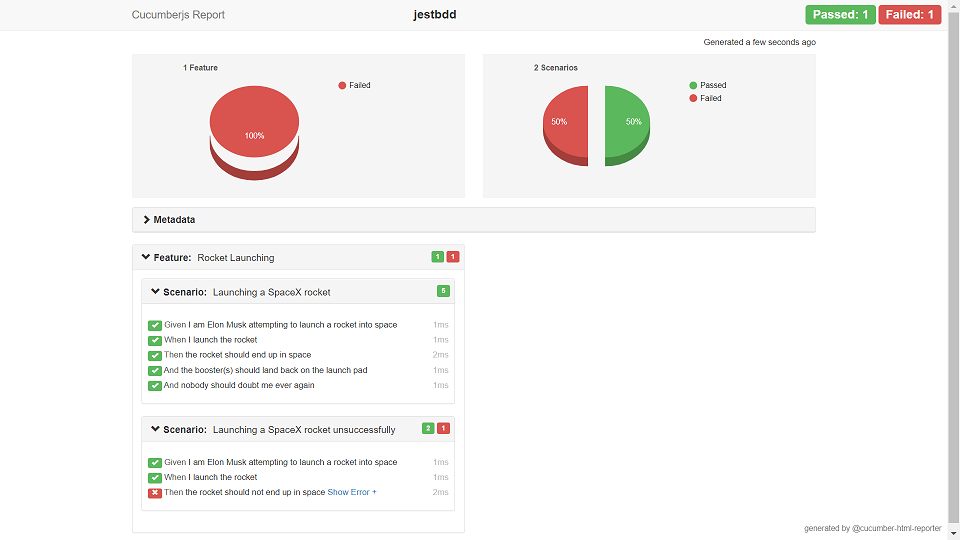

# New insights: writing Gherkin specs with Jest is an overkill and too expensive for the price one pays by not using cucumber.js
The only currently existing solution is the [jest-cucumber](https://github.com/bencompton/jest-cucumber) package. This had one version supporting the reports but this feature was not supported in other versions. As nobody should use outdated packages, I discourage from building on this solution.
I migrated all my tests to cucumber.js in a few days and it was the right decisions. With this all said, I will archive this repo in a few weeks.

---------------------

# jestBdd
Example for nodejs specs implemented with jest and cucumber, using [jest-cucumber](https://github.com/bencompton/jest-cucumber) 
and with a report including a pie chart generated with [cucumber-html-reporter](https://github.com/gkushang/cucumber-html-reporter)

## Motivation
Having a working example for running node tests with jest, cucumber report included. Most examples are for UI frameworks with webpack and TypeScript.

## BDD-Specifications and report generation
Running the tests and generating the reports should always happen in two steps.

### Run the tests
```shell script
npm run jest
// or
npm test
```
### Generate the report as separate step
```shell script
npm run report
```
### Configuration
The source and output folder for the HTML report is defined in ./reports/cucumber-report-config.js
As final step this report should be saved with a timestamp or a version to an artifact manager /file system, server, AWS S3, etc)

### Examples





## to-do
- archive the repo
